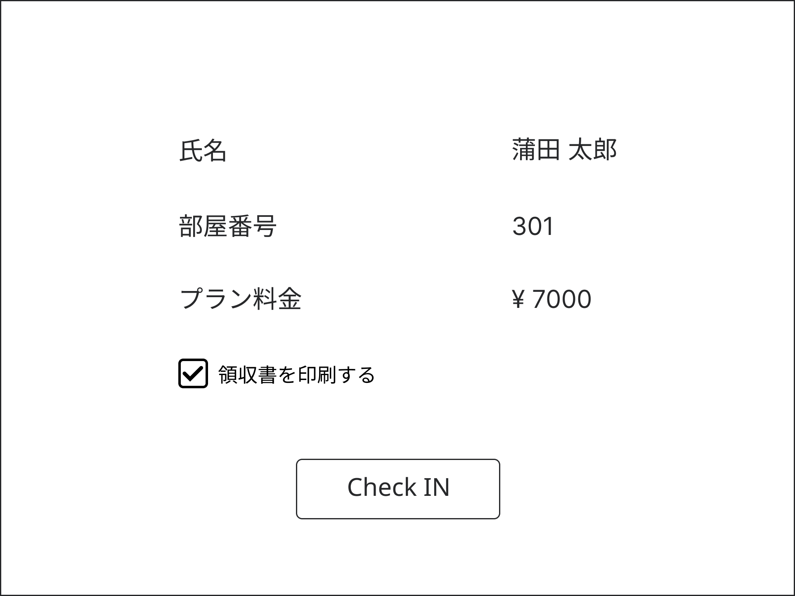

# UI要件定義書
## ログイン
ユーザIDとパスワードを入力・照合してログインするための画面。 
ユーザIDとパスワードの入力欄とログインボタンがある。

## サイドバー
機能ごとに分かれている画面に移動するためのメニュー画面。 
基本的には隠れていて左上のアイコンをクリックすると表示される。

## 機能ごとの画面
### チェックイン・チェックアウト
チェックイン・チェックアウトのメニュー画面

#### チェックイン
1. **入力画面**
   - お名前
   - 電話番号
   - メールアドレス

   
1. **出力画面**
   - 氏名
   - 部屋番号
   - プラン料金
   - 領収書印刷

   

#### チェックアウト
1. **入力画面**
   - 部屋番号

   
1. **出力画面**
   - 氏名
   - 領収書印刷

   

### 顧客情報
顧客情報のメニュー画面

#### 登録
1. **入力画面**
   - 名前
   - ふりがな
   - 電話番号
   - メールアドレス
   - 住所
   - 性別
   - 職業

   
1. **確認画面**
   - 名前
   - ふりがな
   - 電話番号
   - メールアドレス
   - 住所
   - 性別
   - 職業

   
#### 更新
1. **検索画面**
   - 氏名
   - 電話番号
   - メールアドレス

   
1. **入力画面**
   - 名前
   - ふりがな
   - 電話番号
   - メールアドレス
   - 住所
   - 性別
   - 職業

   
1. **確認画面**
   - 名前
   - ふりがな
   - 電話番号
   - メールアドレス
   - 住所
   - 性別
   - 職業

   
#### 削除
1. **検索画面**
   - 氏名
   - 電話番号
   - メールアドレス

   
1. **確認画面**
   - 名前
   - ふりがな
   - 電話番号
   - メールアドレス
   - 住所
   - 性別
   - 職業

   

### 予約情報
#### 予約登録
#### 予約変更
#### 予約削除
#### 予約検索(表示・印刷)

### 請求書・領収書
基本的にはチェックイン・アウトのときに発行する
- 請求書
- 領収書

### 従業員情報
#### 登録
#### 更新
#### 削除

### 部屋情報
部屋情報のメニュー画面

#### 登録
1. **入力画面**
   - 部屋番号
   - 部屋タイプ
   - 価格
   
1. **確認画面**
   - 部屋番号
   - 部屋タイプ
   - 価格
   
#### 更新
1. **検索画面**
   - 部屋番号

   
1. **入力画面**
   - 部屋番号
   - 部屋タイプ
   - 価格

   
1. **確認画面**
   - 部屋番号
   - 部屋タイプ
   - 価格

   
#### 削除
1. **検索画面**
   - 部屋番号

   
1. **確認画面**
   - 部屋番号
   - 部屋タイプ
   - 価格

   