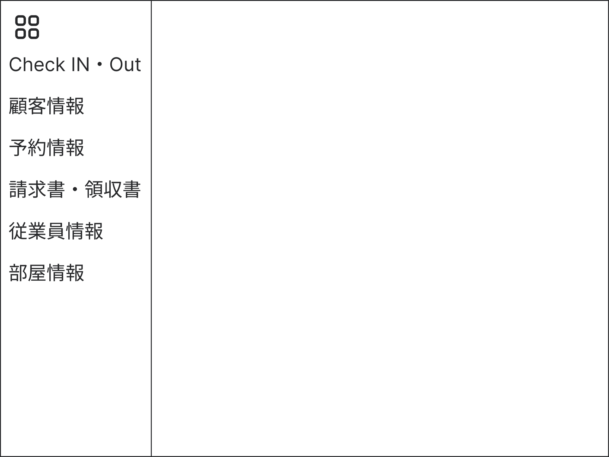

  
# UI要件定義書<!-- omit in toc -->
## メンバー<!-- omit in toc -->
|学籍番号|名前|
|-|-|
|K021C1058|永野 裕馬|
|K021C1059|印銀 克哉|
|K021C1178|鈴木 虎太朗|
|K023C6003|長谷川 日向|
## 設計の前提条件<!-- omit in toc -->
1. このシステムは会社の従業員データベースと連携します。
1. あらかじめ１つ以上の管理者権限をもつアカウントが設定されていて、その他のアカウントを追加する際はこのシステムを使って追加する。
1. アカウント登録は管理者が行い、パスワード登録はユーザー側で行う

---

## 目次<!-- omit in toc -->
- [ログイン画面](#ログイン画面)
- [パスワード設定画面](#パスワード設定画面)
- [サイドバー](#サイドバー)
- [チェックインチェックアウト画面](#チェックインチェックアウト画面)
  - [チェックイン入力画面](#チェックイン入力画面)
  - [チェックイン確認画面](#チェックイン確認画面)
  - [チェックアウト入力画面](#チェックアウト入力画面)
  - [チェックアウト確認画面](#チェックアウト確認画面)
- [顧客情報画面](#顧客情報画面)
  - [顧客情報登録入力画面](#顧客情報登録入力画面)
  - [顧客情報登録確認画面](#顧客情報登録確認画面)
  - [顧客情報変更検索画面](#顧客情報変更検索画面)
  - [顧客情報変更入力画面](#顧客情報変更入力画面)
  - [顧客情報変更確認画面](#顧客情報変更確認画面)
  - [顧客情報削除検索画面](#顧客情報削除検索画面)
  - [顧客情報削除確認画面](#顧客情報削除確認画面)
- [予約情報画面](#予約情報画面)
  - [予約情報検索画面](#予約情報検索画面)
  - [予約情報表示画面](#予約情報表示画面)
  - [予約情報登録入力画面](#予約情報登録入力画面)
  - [予約情報登録確認画面](#予約情報登録確認画面)
  - [予約情報選択画面](#予約情報選択画面)
  - [予約情報変更画面](#予約情報変更画面)
  - [予約情報変更確認画面](#予約情報変更確認画面)
  - [予約情報削除確認画面](#予約情報削除確認画面)
  - [予約情報一覧検索画面](#予約情報一覧検索画面)
  - [予約情報一覧表示画面](#予約情報一覧表示画面)
- [従業員情報画面](#従業員情報画面)
  - [従業員情報登録画面](#従業員情報登録画面)
  - [従業員情報変更画面](#従業員情報変更画面)
  - [従業員情報削除画面](#従業員情報削除画面)
- [部屋情報画面](#部屋情報画面)
  - [部屋情報登録入力画面](#部屋情報登録入力画面)
  - [部屋情報登録確認画面](#部屋情報登録確認画面)
  - [部屋情報変更検索画面](#部屋情報変更検索画面)
  - [部屋情報変更入力画面](#部屋情報変更入力画面)
  - [部屋情報変更確認画面](#部屋情報変更確認画面)
  - [部屋情報削除検索画面](#部屋情報削除検索画面)
  - [部屋情報削除確認画面](#部屋情報削除確認画面)

---
## ログイン画面
ユーザIDとパスワードを入力・照合してログインするための画面。 
パスワード設定用のリンクがある。

**入力する情報**
- 従業員ID
- Password

**エラーメッセージ**
- 従業員IDまたはPasswordが誤っていた場合 
   "従業員IDまたは、Passwordが誤っています。"とメッセージボックスで表示。

**画面遷移先**
- LOGINボタン 
   [チェックインチェックアウト画面](#チェックインチェックアウト画面)
- パスワード設定用のリンク 
   [パスワード設定画面](#パスワード設定画面)

---

## パスワード設定画面
パスワードの設定を行うための画面。

**入力する情報**
- 従業員ID
- Password
- Password(確認用)

**エラーメッセージ**
- 社員IDがシステムに登録されていない場合 
   "入力された社員IDがシステムに登録されていません。"とメッセージボックスで表示。
- 1つ目のPasswordと2つ目のPasswordが異なっていた場合 
   "Passwordが一致していません。"とメッセージボックスで表示。

**画面遷移先**
- 登録
- 戻る 
   両方とも[ログイン画面](#ログイン画面)

---

## サイドバー
それぞれのメニュー画面に画面遷移するための画面。 
基本的には隠れていて左上のアイコンをクリックすると表示される。

**メニュー画面一覧**
- [チェックインチェックアウト画面](#チェックインチェックアウト画面)
- [顧客情報画面](#顧客情報画面)
- [予約情報画面](#予約情報画面)
- [従業員情報画面](#従業員情報画面)
- [部屋情報画面](#部屋情報画面)

---

## チェックインチェックアウト画面
チェックイン・チェックアウトのメニュー画面

**画面遷移先**
- Check INボタン 
   [チェックイン入力画面](#チェックイン入力画面)
- Check OUTボタン 
   [チェックアウト入力画面](#チェックアウト入力画面)

---

### チェックイン入力画面
チェックインする顧客を特定するために顧客情報を入力する画面

**入力する情報**
- 氏名
- 電話番号
- メールアドレス

**エラーメッセージ**
- 入力された顧客情報が登録されていない場合。 
   "入力された顧客情報は登録されていません。"とメッセージボックスで表示。
- 入力された顧客情報の予約が登録されていない場合。 
   "予約登録されていません。"とメッセージボックスで表示。

**画面遷移先**
- 確認ボタン 
   [チェックイン確認画面](#チェックイン確認画面)
- 戻るボタン 
   [チェックインチェックアウト画面](#チェックインチェックアウト画面)

---

### チェックイン確認画面
チェックインする顧客の情報を確認する画面

**表示する情報**
- 氏名
- 部屋番号
- プラン料金
- 領収書印刷

**画面遷移先**
- Check INボタン 
   [チェックインチェックアウト画面](#チェックインチェックアウト画面)
- 戻るボタン 
   [チェックイン入力画面](#チェックイン入力画面)

---

### チェックアウト入力画面
チェックアウトする顧客を特定するために情報を入力する画面

**入力する情報**
- 部屋番号

**画面遷移先**
- 確認ボタン 
   [チェックアウト確認画面](#チェックアウト確認画面)
- 戻るボタン 
   [チェックインチェックアウト画面](#チェックインチェックアウト画面)

---

### チェックアウト確認画面
チェックアウトする顧客を確認する画面

**表示する情報**
- 氏名
- 領収書印刷

**画面遷移先**
- Check Outボタン 
   [チェックインチェックアウト画面](#チェックインチェックアウト画面)
- 戻るボタン 
   [チェックアウト入力画面](#チェックアウト入力画面)

---

## 顧客情報画面
顧客情報のメニュー画面

**画面遷移先**
- 顧客情報登録ボタン 
   [顧客情報登録入力画面](#顧客情報登録入力画面)
- 顧客情報変更ボタン 
   [顧客情報変更検索画面](#顧客情報変更検索画面)
- 顧客情報削除ボタン 
   [顧客情報削除検索画面](#顧客情報削除検索画面)

---

### 顧客情報登録入力画面
顧客情報を登録するために入力する画面

**入力する情報**
- 氏名
- ふりがな
- 電話番号
- メールアドレス
- 住所
- 性別
- 職業

**画面遷移先**
- 確認ボタン 
   [顧客情報登録確認画面](#顧客情報登録確認画面)
- 戻るボタン 
   [顧客情報画面](#顧客情報画面)

---

### 顧客情報登録確認画面
顧客情報を登録するために顧客情報を確認する画面

**表示する情報**
- 氏名
- ふりがな
- 電話番号
- メールアドレス
- 住所
- 性別
- 職業

**画面遷移先**
- 登録ボタン 
   [顧客情報画面](#顧客情報画面)
- 戻るボタン 
   [顧客情報登録入力画面](#顧客情報登録入力画面)

---

### 顧客情報変更検索画面
顧客情報を変更するために顧客情報を検索する画面

**入力する情報**
- 氏名
- 電話番号
- メールアドレス

**画面遷移先**
- 検索ボタン 
   [顧客情報変更入力画面](#顧客情報変更入力画面)
- 戻るボタン 
   [顧客情報画面](#顧客情報画面)

---

### 顧客情報変更入力画面
顧客情報を変更するために顧客情報を入力する画面

**入力する情報**
- 氏名
- ふりがな
- 電話番号
- メールアドレス
- 住所
- 性別
- 職業

**画面遷移先**
- 確認ボタン 
   [顧客情報変更確認画面](#顧客情報変更確認画面)
- 戻るボタン 
   [顧客情報変更検索画面](#顧客情報変更検索画面)

---

### 顧客情報変更確認画面
顧客情報を変更するために確認する画面

**表示する情報**
- 氏名
- ふりがな
- 電話番号
- メールアドレス
- 住所
- 性別
- 職業

**画面遷移先**
- 変更ボタン 
   [顧客情報画面](#顧客情報画面)
- 戻るボタン 
   [顧客情報変更入力画面](#顧客情報変更入力画面)

---

### 顧客情報削除検索画面
顧客情報を削除するために顧客情報を検索する画面

**入力する情報**
- 氏名
- 電話番号
- メールアドレス

**画面遷移先**
- 検索ボタン 
   [顧客情報削除確認画面](#顧客情報削除確認画面)
- 戻るボタン 
   [顧客情報画面](#顧客情報画面)

---

### 顧客情報削除確認画面
顧客情報を削除するために顧客情報を確認する画面

**確認する情報**
- 氏名
- ふりがな
- 電話番号
- メールアドレス
- 住所
- 性別
- 職業

**画面遷移先**
- 削除ボタン 
   [顧客情報画面](#顧客情報画面)
- 戻るボタン 
   [顧客情報削除検索画面](#顧客情報削除検索画面)

---

## 予約情報画面
予約情報のメニュー画面

**画面遷移先**
- 予約編集ボタン 
   [予約情報検索画面](#予約情報検索画面)
- 予約表示・印刷ボタン 
   [予約情報一覧検索画面](#予約情報一覧検索画面)

---

### 予約情報検索画面
編集する予約情報を検索するために顧客情報を入力する画面

**入力する情報**
- 氏名
- 電話番号
- メールアドレス

**画面遷移先**
- 検索ボタン 
   [予約情報表示画面](#予約情報表示画面)
- 戻るボタン 
   [予約情報画面](#予約情報画面)

---

### 予約情報表示画面
編集する予約情報を選択する画面 
他人が予約済みだと部屋番号が赤く表示され、選択できない。

**入力する情報**
- 日付

**画面遷移先**
- 部屋番号 
   部屋番号が白い場合：[予約情報登録入力画面](#予約情報登録入力画面) 
   部屋番号が黄色い場合：[予約情報選択画面](#予約情報選択画面)
- 戻るボタン 
   [予約情報検索画面](#予約情報検索画面)

---

### 予約情報登録入力画面
残りの予約情報を入力する画面。

**入力する情報**
- 宿泊日数
- 朝食の有無

**画面遷移先**
- 確認ボタン 
	[予約情報登録確認画面](#予約情報登録確認画面)
- 戻るボタン 
	[予約情報表示画面](#予約情報表示画面)

---

### 予約情報登録確認画面
登録する予約情報を確認する画面

**表示する情報**
- 氏名
- 日付
- 宿泊日数
- 部屋タイプ
- 朝食
- 料金

**画面遷移先**
- 登録ボタン 
	[予約情報画面](#予約情報画面)
- 戻るボタン 
	[予約情報登録入力画面](#予約情報登録入力画面)

---

### 予約情報選択画面
変更するか、削除するかを選択するための画面

**画面遷移先**
- 変更ボタン 
	[予約情報変更画面](#予約情報変更画面)
- 削除ボタン 
	[予約情報削除確認画面](#予約情報削除確認画面)
- 戻るボタン 
	[予約情報表示画面](#予約情報表示画面)

---

### 予約情報変更画面
予約情報の変更内容を入力する画面

**入力する情報**
- 宿泊日数
- 朝食の有無

**画面遷移先**
- 確認ボタン 
	[予約情報変更確認画面](#予約情報変更確認画面)
- 戻るボタン 
	[予約情報選択画面](#予約情報選択画面)

---

### 予約情報変更確認画面
予約情報の変更内容を確認する画面

**表示する情報**
- 氏名
- 日付
- 宿泊日数
- 部屋タイプ
- 朝食の有無
- 料金

**画面遷移先**
- 変更 
	[予約情報画面](#予約情報画面)
- 戻る 
	[予約情報変更画面](#予約情報変更画面)

---

### 予約情報削除確認画面
予約情報の削除内容を確認する画面

**表示する情報**
- 氏名
- 日付
- 宿泊日数
- 部屋タイプ
- 朝食の有無
- 料金

**画面遷移先**
- 削除ボタン 
	[予約情報画面](#予約情報画面)
- 戻るボタン 
	[予約情報選択画面](#予約情報選択画面)

---

### 予約情報一覧検索画面
一覧表示したい予約情報の日付を範囲指定する画面

**入力する情報**
- 日付(範囲の開始日と終了日の２つ)

**画面遷移先**
- 検索ボタン 
	[予約情報一覧表示画面](#予約情報一覧表示画面)
- 戻るボタン 
	[予約情報画面](#予約情報画面)

---

### 予約情報一覧表示画面
予約情報を一覧で表示・印刷する画面

**表示する情報**
- 日付
- 部屋番号

**画面遷移先**
- 戻るボタン 
	[予約情報一覧検索画面](#予約情報一覧検索画面)

---

## 従業員情報画面
従業員情報のメニュー画面

**画面遷移先**
- 従業員情報登録 
   [従業員情報登録画面](#従業員情報登録画面)
- 従業員情報変更 
   [従業員情報変更画面](#従業員情報変更画面)
- 従業員情報削除 
   [従業員情報削除画面](#従業員情報削除画面)

---

### 従業員情報登録画面
従業員情報を登録する画面。

**入力情報**
- 従業員ID

**画面遷移先**
- 登録ボタン
- 戻るボタン 
   両方とも[従業員情報画面](#従業員情報画面)

---

### 従業員情報変更画面
従業員情報の変更をする画面。 
管理者権限の付与とパスワードの削除ができる。

**入力情報**
- 従業員ID

**画面遷移先**
- 変更ボタン
- 戻るボタン 
   両方とも[従業員情報画面](#従業員情報画面)

---

### 従業員情報削除画面
従業員情報の削除をする画面。

**画面遷移先**
- 削除ボタン
- 戻るボタン 
   両方とも[従業員情報画面](#従業員情報画面)

---

## 部屋情報画面
部屋情報のメニュー画面

**画面遷移先**
- 部屋情報登録 
   [部屋情報登録入力画面](#部屋情報登録入力画面)
- 部屋情報変更 
   [部屋情報変更検索画面](#部屋情報変更検索画面)
- 部屋情報削除 
   [部屋情報削除検索画面](#部屋情報削除検索画面)

---

### 部屋情報登録入力画面
登録する部屋情報を入力する画面

**入力する情報**
- 部屋番号
- 部屋タイプ
- 価格

**画面遷移先**
- 確認ボタン 
   [部屋情報登録確認画面](#部屋情報登録確認画面)
- 戻るボタン 
   [部屋情報画面](#部屋情報画面)

---

### 部屋情報登録確認画面
登録する部屋情報を確認する画面

**表示する情報**
- 部屋番号
- 部屋タイプ
- 価格

**画面遷移先**
- 登録ボタン 
   [部屋情報画面](#部屋情報画面)
- 戻るボタン 
   [部屋情報登録入力画面](#部屋情報登録入力画面)

---

### 部屋情報変更検索画面
変更する部屋情報を検索する画面

**入力する情報**
- 部屋番号

**画面遷移先**
- 検索ボタン 
   [部屋情報変更入力画面](#部屋情報変更入力画面)
- 戻るボタン 
   [部屋情報画面](#部屋情報画面)

---

### 部屋情報変更入力画面
変更する部屋情報を入力する画面

**入力する情報**
- 部屋タイプ
- 価格

**画面遷移先**
- 確認ボタン 
      [部屋情報変更確認画面](#部屋情報変更確認画面)
- 戻るボタン 
   [部屋情報変更検索画面](#部屋情報変更検索画面)

---

### 部屋情報変更確認画面
変更する部屋情報を確認する画面

**表示する情報**
- 部屋番号
- 部屋タイプ
- 価格

**画面遷移先**
- 変更ボタン 
   [部屋情報画面](#部屋情報画面)
- 戻るボタン 
   [部屋情報変更入力画面](#部屋情報変更入力画面)

---

### 部屋情報削除検索画面
削除する部屋情報を検索する画面

**入力する情報**
- 部屋番号

**画面遷移先**
- 検索ボタン 
   [部屋情報削除確認画面](#部屋情報削除確認画面)
- 戻るボタン 
   [部屋情報画面](#部屋情報画面)

---

### 部屋情報削除確認画面
確認する部屋情報を確認する画面

**入力する情報**
- 部屋番号
- 部屋タイプ
- 価格

**画面遷移先**
- 削除ボタン 
   [部屋情報画面](#部屋情報画面)
- 戻るボタン 
   [部屋情報削除検索画面](#部屋情報削除検索画面)

