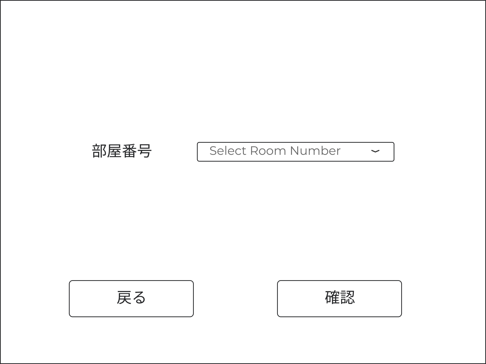

# UI要件定義書
## 設計の前提条件
1. このシステムは会社の従業員データベースと連携します。
1. あらかじめ１つ以上の管理者権限をもつアカウントが設定されていて、その他のアカウントを追加する際はこのシステムを使って追加する。
1. アカウント登録は管理者が行い、パスワード登録はユーザー側で行う
## ログイン
ユーザIDとパスワードを入力・照合してログインするための画面。 
ユーザIDとパスワードの入力欄とログインボタンがある。

## パスワードの初期設定
パスワードは2回入力させる。

## サイドバー
機能ごとに分かれている画面に移動するためのメニュー画面。 
基本的には隠れていて左上のアイコンをクリックすると表示される。

## 機能ごとの画面
### チェックイン・チェックアウト
チェックイン・チェックアウトのメニュー画面

#### チェックイン
1. **入力画面**
   - お名前
   - 電話番号
   - メールアドレス

   
1. **出力画面**
   - 氏名
   - 部屋番号
   - プラン料金
   - 領収書印刷

   

#### チェックアウト
1. **入力画面**
   - 部屋番号

   
1. **出力画面**
   - 氏名
   - 領収書印刷

   

### 顧客情報
顧客情報のメニュー画面

#### 登録
1. **入力画面**
   - 名前
   - ふりがな
   - 電話番号
   - メールアドレス
   - 住所
   - 性別
   - 職業

   
1. **確認画面**
   - 名前
   - ふりがな
   - 電話番号
   - メールアドレス
   - 住所
   - 性別
   - 職業

   
#### 更新
1. **検索画面**
   - 氏名
   - 電話番号
   - メールアドレス

   
1. **入力画面**
   - 名前
   - ふりがな
   - 電話番号
   - メールアドレス
   - 住所
   - 性別
   - 職業

   
1. **確認画面**
   - 名前
   - ふりがな
   - 電話番号
   - メールアドレス
   - 住所
   - 性別
   - 職業

   
#### 削除
1. **検索画面**
   - 氏名
   - 電話番号
   - メールアドレス

   
1. **確認画面**
   - 名前
   - ふりがな
   - 電話番号
   - メールアドレス
   - 住所
   - 性別
   - 職業

   

### 予約情報
#### 予約登録
1. **入力画面**
   - 氏名
   - 電話番号
   - メールアドレス
   - 日付
   - 宿泊日数
   - 部屋タイプ
   - 朝食の有無

1. **確認画面**
   - 氏名
   - 電話番号
   - メールアドレス
   - 日付
   - 宿泊日数
   - 部屋タイプ
   - 朝食の有無

#### 予約変更
#### 予約削除
1. **入力画面**
日付で検索する予約の範囲を決めている
   - 氏名
   - 電話番号
   - メールアドレス
   - 日付

1. **確認画面**
複数あった時のために表形式で結果を表示している。
   - 氏名
   - 日付
   - 宿泊日数
   - 部屋タイプ
   - 朝食
   - 削除判定用のチェックボックス

#### 予約検索(表示・印刷)

### 請求書・領収書
基本的にはチェックイン・アウトのときに発行する
- 請求書
- 領収書

### 従業員情報
氏名・フリガナは会社の従業員データベースから取ってくる
社員IDを入力し、ボタンを押すと氏名・フリガナが自動入力される。
#### 登録
従業員の登録
1. **登録画面**
   - 社員ID
   - 氏名
   - フリガナ
   - 管理者権限の有無

#### 更新
管理者権限の付与・取り消し
1. **更新画面**
   - 社員ID
   - 氏名
   - フリガナ
   - 管理者権限の有無

#### 削除
このシステムを使わなくなった従業員情報を削除
1. **削除画面**
   - 社員ID
   - 氏名
   - フリガナ
   - 管理者権限の有無

### 部屋情報
部屋情報のメニュー画面

#### 登録
1. **入力画面**
   - 部屋番号
   - 部屋タイプ
   - 価格

   
1. **確認画面**
   - 部屋番号
   - 部屋タイプ
   - 価格

   
#### 更新
1. **検索画面**
   - 部屋番号

   
1. **入力画面**
   - 部屋番号
   - 部屋タイプ
   - 価格

   
1. **確認画面**
   - 部屋番号
   - 部屋タイプ
   - 価格

   
#### 削除
1. **検索画面**
   - 部屋番号

   
1. **確認画面**
   - 部屋番号
   - 部屋タイプ
   - 価格

   