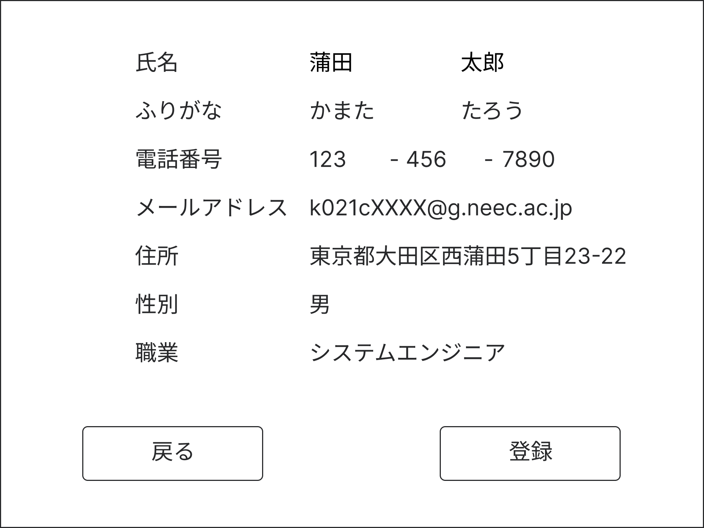
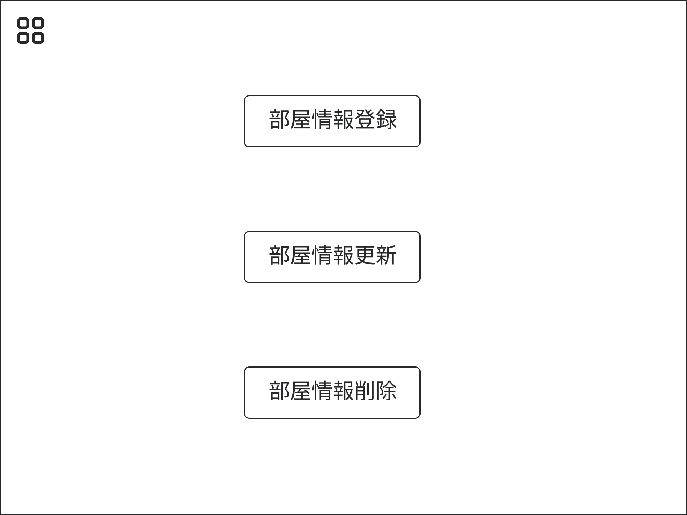

# UI要件定義書
## 設計の前提条件
1. このシステムは会社の従業員データベースと連携します。
1. あらかじめ１つ以上の管理者権限をもつアカウントが設定されていて、その他のアカウントを追加する際はこのシステムを使って追加する。
1. アカウント登録は管理者が行い、パスワード登録はユーザー側で行う

## ログイン画面
ユーザIDとパスワードを入力・照合してログインするための画面。 
パスワード設定用のリンクがある。

**入力する情報**
- 従業員ID
- Password

**画面遷移先**
- LOGINボタン 
   [チェックイン・チェックアウト画面](#チェックイン・チェックアウト画面)
- パスワード設定用のリンク 
   [パスワード設定画面](#パスワード設定画面)

## パスワード設定画面
パスワードの設定を行うための画面。

**入力する情報**
- 従業員ID
- Password
- Password(確認用)

**画面遷移先**
- 登録
- 戻る 
   両方とも[ログイン画面](#ログイン画面)

## サイドバー
それぞれのメニュー画面に画面遷移するための画面。 
基本的には隠れていて左上のアイコンをクリックすると表示される。

**メニュー画面一覧**
- [チェックイン・チェックアウト画面](#チェックイン・チェックアウト画面)
- [顧客情報画面](#顧客情報画面)
- [予約情報画面](#予約情報画面)
- [従業員情報画面](#従業員情報画面)
- [部屋情報画面](#部屋情報画面)

## チェックイン・チェックアウト画面
チェックイン・チェックアウトのメニュー画面

**画面遷移先**
- Check INボタン 
   [チェックイン入力画面](#チェックイン入力画面)
- Check OUTボタン 
   [チェックアウト入力画面](#チェックアウト入力画面)

### チェックイン入力画面
チェックインする顧客を特定するために顧客情報を入力する画面

**入力する情報**
- 氏名
- 電話番号
- メールアドレス

**画面遷移先**
- 確認ボタン 
   [チェックイン確認画面](#チェックイン確認画面)
- 戻るボタン 
   [チェックイン・チェックアウト画面](#チェックイン・チェックアウト画面)

### チェックイン確認画面
チェックインする顧客の情報を確認する画面

**表示する情報**
- 氏名
- 部屋番号
- プラン料金
- 領収書印刷

**画面遷移先**
- Check INボタン 
   [チェックイン・チェックアウト画面](#チェックイン・チェックアウト画面)
- 戻るボタン 
   [チェックイン入力画面](#チェックイン入力画面)

### チェックアウト入力画面
チェックアウトする顧客を特定するために情報を入力する画面

**入力する情報**
- 部屋番号

**画面遷移先**
- 確認ボタン 
   [チェックアウト確認画面](#チェックアウト確認画面)
- 戻るボタン 
   [チェックイン・チェックアウト画面](#チェックイン・チェックアウト画面)

### チェックアウト確認画面
チェックアウトする顧客を確認する画面

**表示する情報**
- 氏名
- 領収書印刷

**画面遷移先**
- Check Outボタン 
   [チェックイン・チェックアウト画面](#チェックイン・チェックアウト画面)
- 戻るボタン 
   [チェックアウト入力画面](#チェックアウト入力画面)

## 顧客情報画面
顧客情報のメニュー画面

**画面遷移先**
- 顧客情報登録ボタン 
   [顧客情報登録入力画面](#顧客情報登録入力画面)
- 顧客情報変更ボタン 
   [顧客情報変更検索画面](#顧客情報変更検索画面)
- 顧客情報削除ボタン 
   [顧客情報削除検索画面](#顧客情報削除検索画面)

### 顧客情報登録入力画面
顧客情報を登録するために入力する画面

**入力する情報**
- 氏名
- ふりがな
- 電話番号
- メールアドレス
- 住所
- 性別
- 職業

**画面遷移先**
- 確認ボタン 
   [顧客情報登録確認画面](#顧客情報登録確認画面)
- 戻るボタン 
   [顧客情報画面](#顧客情報画面)

### 顧客情報登録確認画面
顧客情報を登録するために顧客情報を確認する画面

**表示する情報**
- 氏名
- ふりがな
- 電話番号
- メールアドレス
- 住所
- 性別
- 職業

**画面遷移先**
- 登録ボタン 
   [顧客情報画面](#顧客情報画面)
- 戻るボタン 
   [顧客情報登録入力画面](#顧客情報登録入力画面)

### 顧客情報変更検索画面
顧客情報を変更するために顧客情報を検索する画面

**入力する情報**
- 氏名
- 電話番号
- メールアドレス

**画面遷移先**
- 検索ボタン 
   [顧客情報変更入力画面](#顧客情報変更入力画面)
- 戻るボタン 
   [顧客情報画面](#顧客情報画面)

### 顧客情報変更入力画面
顧客情報を変更するために顧客情報を入力する画面

**入力する情報**
- 氏名
- ふりがな
- 電話番号
- メールアドレス
- 住所
- 性別
- 職業

**画面遷移先**
- 確認ボタン 
   [顧客情報変更確認画面](#顧客情報変更確認画面)
- 戻るボタン 
   [顧客情報変更検索画面](#顧客情報変更検索画面)

### 顧客情報変更確認画面
顧客情報を変更するために確認する画面

**表示する情報**
- 氏名
- ふりがな
- 電話番号
- メールアドレス
- 住所
- 性別
- 職業

**画面遷移先**
- 変更ボタン 
   [顧客情報画面](#顧客情報画面)
- 戻るボタン 
   [顧客情報変更入力画面](#顧客情報変更入力画面)

### 顧客情報削除検索画面
顧客情報を削除するために顧客情報を検索する画面

**入力する情報**
- 氏名
- 電話番号
- メールアドレス

**画面遷移先**
- 検索ボタン 
   [顧客情報削除確認画面](#顧客情報削除確認画面)
- 戻るボタン 
   [顧客情報画面](#顧客情報画面)

### 顧客情報削除確認画面
顧客情報を削除するために顧客情報を確認する画面

**確認する情報**
- 氏名
- ふりがな
- 電話番号
- メールアドレス
- 住所
- 性別
- 職業

**画面遷移先**
- 削除ボタン 
   [顧客情報画面](#顧客情報画面)
- 戻るボタン 
   [顧客情報削除確認画面](#顧客情報削除確認画面)

## 予約情報画面
予約情報のメニュー画面

### 予約情報検索画面
- 氏名
- 電話番号
- メールアドレス

### 予約情報表示画面
日付を選択するとその日の部屋の予約情報が表示される

### 予約情報登録入力画面
予約情報検索画面で顧客情報を入力していて、予約したい部屋の情報も予約情報表示画面で選択した部屋なので残りの情報を入力する。
- 宿泊日数
- 朝食の有無

### 予約情報登録確認画面

- 氏名
- 日付
- 宿泊日数
- 部屋タイプ
- 朝食
- 料金

### 予約情報選択画面
予約情報表示画面ですでに自分が予約済みの部屋を選択した時に変更するか、削除するかを選択するための画面

### 予約情報変更画面
- 宿泊日数
- 朝食の有無

### 予約情報変更確認画面
- 氏名
- 日付
- 宿泊日数
- 部屋タイプ
- 朝食の有無
- 料金

### 予約情報削除確認画面
- 氏名
- 日付
- 宿泊日数
- 部屋タイプ
- 朝食の有無
- 料金

### 予約情報一覧検索画面
日付を開始日と終了日で選択する

### 予約情報一覧表示画面
予約情報一覧検索画面で選択した日付の予約を一覧で表示。 
印刷ボタンを押すと印刷プレビューが表示される。

## 従業員情報画面
氏名・フリガナは会社の従業員データベースから取ってくる
社員IDを入力し、ボタンを押すと氏名・フリガナが自動入力される機能がある。

### 従業員情報登録画面
社員IDを入力し、ボタンを押すと氏名・フリガナが自動入力される 
管理者権限の付与もこの段階でできる(更新でもできる)。

### 従業員情報更新画面
管理者権限の付与とパスワードの削除ができる。

### 従業員情報削除画面
従業員情報を削除するのみ。

## 部屋情報画面
部屋情報のメニュー画面

### 部屋情報登録入力画面
- 部屋番号
- 部屋タイプ
- 価格

### 部屋情報登録確認画面
- 部屋番号
- 部屋タイプ
- 価格

### 部屋情報変更検索画面
- 部屋番号

### 部屋情報変更入力画面
- 部屋番号
- 部屋タイプ
- 価格

### 部屋情報変更確認画面
- 部屋番号
- 部屋タイプ
- 価格

### 部屋情報削除検索画面
- 部屋番号

### 部屋情報削除確認画面

- 部屋番号
- 部屋タイプ
- 価格

