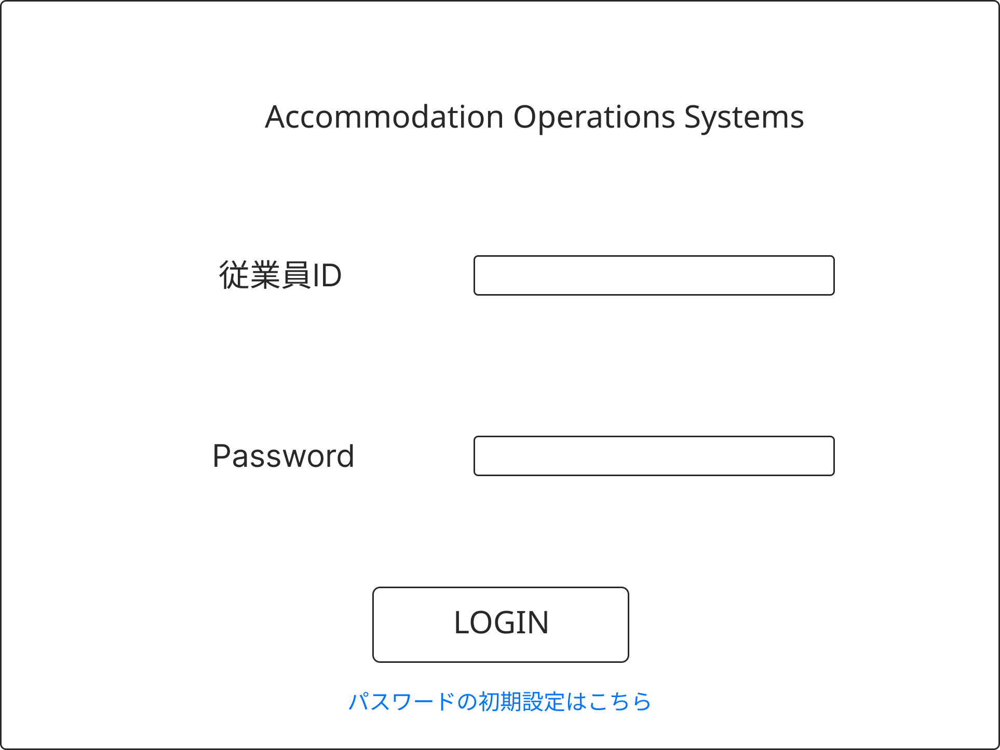
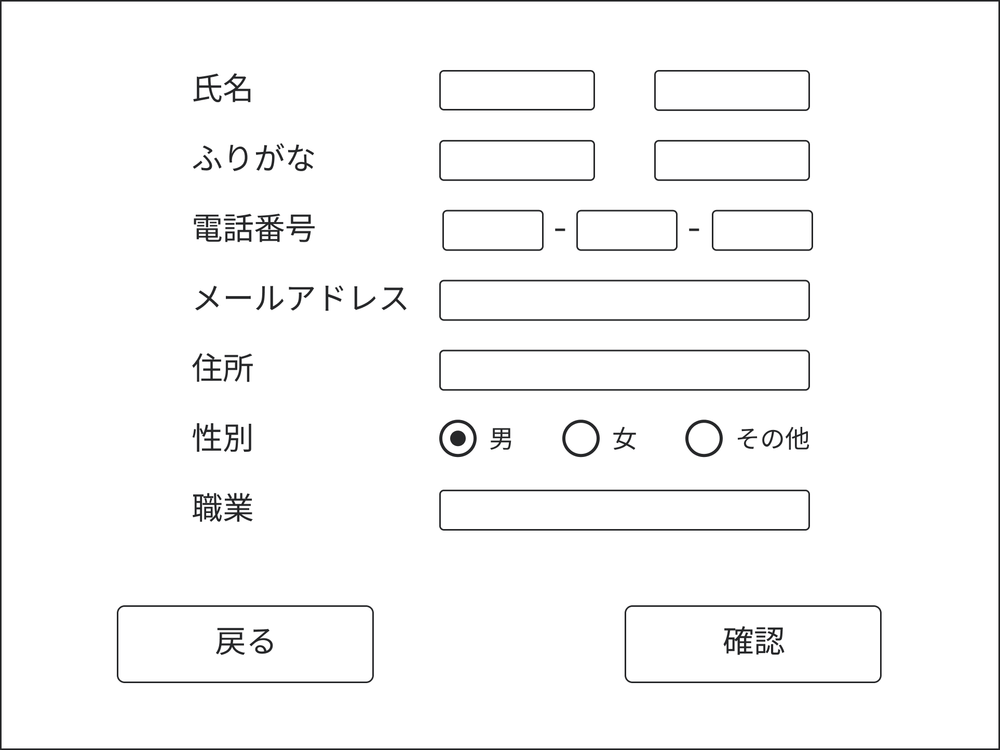
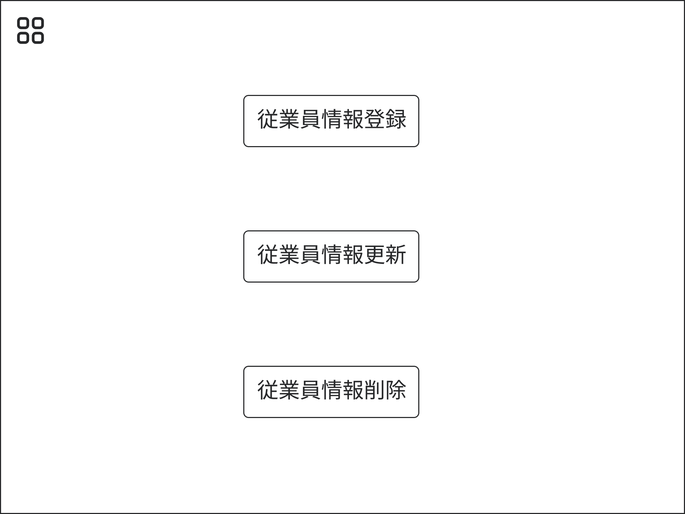

# UI要件定義書
## 設計の前提条件
1. このシステムは会社の従業員データベースと連携します。
1. あらかじめ１つ以上の管理者権限をもつアカウントが設定されていて、その他のアカウントを追加する際はこのシステムを使って追加する。
1. アカウント登録は管理者が行い、パスワード登録はユーザー側で行う
## ログイン画面
ユーザIDとパスワードを入力・照合してログインするための画面。 
ユーザIDとパスワードの入力欄とログインボタンがある。

## パスワード設定画面
パスワードの設定は従業員本人が行う
パスワードは2回入力させる。

## サイドバー
機能ごとに分かれている画面に移動するためのメニュー画面。 
基本的には隠れていて左上のアイコンをクリックすると表示される。

## 機能ごとの画面
### チェックイン・チェックアウト
チェックイン・チェックアウトのメニュー画面

#### チェックイン
1. **入力画面**
   - お名前
   - 電話番号
   - メールアドレス

   
1. **確認画面**
   - 氏名
   - 部屋番号
   - プラン料金
   - 領収書印刷

   

#### チェックアウト
1. **入力画面**
   - 部屋番号

   
1. **確認画面**
   - 氏名
   - 領収書印刷

   

### 顧客情報
顧客情報のメニュー画面

#### 登録
1. **入力画面**
   - 名前
   - ふりがな
   - 電話番号
   - メールアドレス
   - 住所
   - 性別
   - 職業

   
1. **確認画面**
   - 名前
   - ふりがな
   - 電話番号
   - メールアドレス
   - 住所
   - 性別
   - 職業

   
#### 更新
1. **検索画面**
   - 氏名
   - 電話番号
   - メールアドレス

   
1. **入力画面**
   - 名前
   - ふりがな
   - 電話番号
   - メールアドレス
   - 住所
   - 性別
   - 職業

   
1. **確認画面**
   - 名前
   - ふりがな
   - 電話番号
   - メールアドレス
   - 住所
   - 性別
   - 職業

   
#### 削除
1. **検索画面**
   - 氏名
   - 電話番号
   - メールアドレス

   
1. **確認画面**
   - 名前
   - ふりがな
   - 電話番号
   - メールアドレス
   - 住所
   - 性別
   - 職業

   

### 予約情報画面
予約情報のメニュー画面

#### 予約情報編集
1. **予約情報検索画面**
   - 氏名
   - 電話番号
   - メールアドレス

   

1. **予約情報表示画面** 
日付を選択するとその日の部屋の予約情報が表示される

1. **予約情報登録入力画面** 
予約情報検索画面で顧客情報を入力していて、予約したい部屋の情報も予約情報表示画面で選択した部屋なので残りの情報を入力する。
   - 宿泊日数
   - 朝食の有無

   
1. **予約情報登録確認画面**
   - 氏名
   - 日付
   - 宿泊日数
   - 部屋タイプ
   - 朝食
   - 料金

   
1. **予約情報選択画面** 
予約情報表示画面ですでに自分が予約済みの部屋を選択した時に変更するか、削除するかを選択するための画面

1. **予約情報変更画面**
   - 宿泊日数
   - 朝食の有無

   
1. **予約情報変更確認画面**
   - 氏名
   - 日付
   - 宿泊日数
   - 部屋タイプ
   - 朝食の有無
   - 料金

1. **予約情報削除確認画面**
   - 氏名
   - 日付
   - 宿泊日数
   - 部屋タイプ
   - 朝食の有無
   - 料金

#### 予約検索(表示・印刷)

### 請求書・領収書
基本的にはチェックイン・アウトのときに発行する
- 請求書
- 領収書

### 従業員情報
氏名・フリガナは会社の従業員データベースから取ってくる
社員IDを入力し、ボタンを押すと氏名・フリガナが自動入力される機能がある。

#### 従業員情報登録
社員IDを入力し、ボタンを押すと氏名・フリガナが自動入力される 
管理者権限の付与もこの段階でできる(更新でもできる)。

#### 従業員情報更新
管理者権限の付与とパスワードの削除ができる。

#### 従業員情報削除
従業員情報を削除するのみ。

### 部屋情報
部屋情報のメニュー画面

#### 登録
1. **入力画面**
   - 部屋番号
   - 部屋タイプ
   - 価格

   
1. **確認画面**
   - 部屋番号
   - 部屋タイプ
   - 価格

   
#### 更新
1. **検索画面**
   - 部屋番号

   
1. **入力画面**
   - 部屋番号
   - 部屋タイプ
   - 価格

   
1. **確認画面**
   - 部屋番号
   - 部屋タイプ
   - 価格

   
#### 削除

1. **検索画面**
   - 部屋番号

   
1. **確認画面**

   - 部屋番号
   - 部屋タイプ
   - 価格

   

